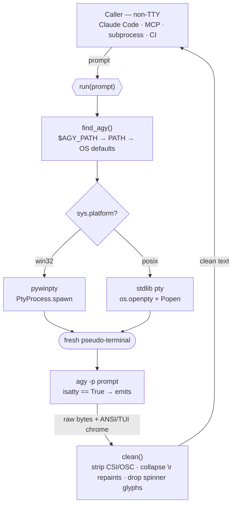

<div align="center">

# agy-headless-bridge

### Call the Google **Antigravity CLI** (`agy`) headlessly — and actually get output back.

Codename **PtyGravity** · pty + antiGravity

[](LICENSE)
[](https://www.python.org)
[]()
[]()

📖 **[Architecture & docs → rhishi99.github.io/agy-headless-bridge](https://rhishi99.github.io/agy-headless-bridge/)**

</div>

---

`agy -p "<prompt>"` prints **nothing** when its stdout is not a real terminal —
so calling it from a subprocess, an MCP server, CI, or another coding agent
(Claude Code, etc.) yields an empty string and exit `0`. This package fixes
that. It runs `agy` through a **fresh pseudo-terminal**, so `agy` sees a tty and
emits normally; the bridge then strips the ANSI/TUI noise and hands you clean
text.

```python
from agy_headless_bridge import run

print(run("Explain a closure in one line."))
# -> A closure is a function that remembers variables from the scope where it was defined.
```

It ships three entry points around one core:

| Entry point | Import / command | Use it for |
|---|---|---|
| **Library** | `from agy_headless_bridge import run` | embedding agy in your Python |
| **CLI** | `agy-bridge "prompt"` / `python -m agy_headless_bridge` | shell scripts, quick calls |
| **MCP server** | `python -m agy_headless_bridge.mcp_server` | letting an agent (Claude Code) call agy as a tool |

---

## The problem — upstream bug [#76]

`agy` gates its stdout on `isatty()`. The instant stdout isn't a terminal, it
goes silent — no output, no error, exit `0`:

```console
$ agy -p "say hi" | cat
$            # empty. exit 0. nothing.
```

The common `winpty agy -p "..."` workaround needs a terminal that **already
exists**, so it still fails from any automated/non-TTY caller.

## The fix — give agy a tty it didn't ask for

Allocate a **brand-new** pseudo-terminal (one that needs no parent tty) and
attach `agy` to it. Same code path on every OS — only the pty allocator differs.



| Platform | pty backend | Status |
|---|---|---|
| **Windows** | ConPTY via [`pywinpty`] (`PtyProcess`) | ✅ verified (agy 1.0.6) |
| **Linux / macOS** | stdlib [`pty`] (`os.openpty` + `subprocess.Popen`) | 🧪 implemented, **untested** — reports welcome |

> **Why not just the existing `agy` Claude Code plugins?** They wrap `agy` for
> *triggering* (slash commands, model selection) but still call `agy -p`
> directly — so in any headless context they hit this exact empty-output bug.
> This package fixes the I/O layer they're missing. **Use both together.**

---

## Install

```bash
pip install agy-headless-bridge          # pywinpty auto-installs on Windows only
```

From source:

```bash
git clone https://github.com/rhishi99/agy-headless-bridge
cd agy-headless-bridge
pip install -e .
```

**Prerequisite:** the Antigravity CLI itself, installed and authenticated
(<https://antigravity.google/cli>). The bridge locates the binary via, in order:
`$AGY_PATH` → `agy` on `PATH` → OS default install paths.

---

## Usage

### Library

```python
from agy_headless_bridge import run, AgyNotFoundError

try:
    answer = run("reply with exactly: OK", timeout=60)
    print(answer)
except AgyNotFoundError:
    print("install agy first")
```

`run(prompt, timeout=180, agy_path=None) -> str` — raises `AgyNotFoundError` if
the binary is missing, `TimeoutError` on timeout, `ValueError` on empty prompt.
Returns `""` only if agy genuinely emitted nothing.

### CLI

```bash
agy-bridge "reply with exactly: OK"
python -m agy_headless_bridge "reply with exactly: OK"   # equivalent
```

### MCP server (Claude Code & other MCP clients)

```bash
claude mcp add --transport stdio antigravity -- \
    python -m agy_headless_bridge.mcp_server
```

Or add to your MCP config manually:

```json
{
  "mcpServers": {
    "antigravity": {
      "command": "python",
      "args": ["-m", "agy_headless_bridge.mcp_server"]
    }
  }
}
```

Exposes two tools — **`agy_ask(prompt)`** and **`agy_research(query)`** — so your
agent can delegate work to Antigravity / Gemini. The server speaks JSON-RPC
stdio directly (no MCP SDK dependency) and routes every call through the pty
bridge, so it works in the non-TTY context an MCP host runs it in.

---

## Configuration

| Env var | Default | Meaning |
|---|---|---|
| `AGY_PATH` | auto-detect | Absolute path to the `agy` binary |
| `AGY_BRIDGE_TIMEOUT` | `180` | Seconds before a call is killed |

---

## How `clean()` works

`agy`'s pty output is a TUI stream, not plain text. `clean()` removes:

- **CSI / OSC ANSI escapes** — colors, cursor moves, window-title sets
- **`\r` repaints** — a spinner overwrites one line many times; only the final
  paint is kept
- **box-drawing & spinner glyphs** — `╭─╮ │ ⠋⠙⠹` TUI chrome

…leaving just the model's answer.

---

## Development

```bash
pip install -e ".[dev]"
pytest
```

Unit tests (cleaning, arg validation, binary discovery) always run. The live
`agy` round-trip test **auto-skips** when `agy` isn't installed, so CI stays
green without Antigravity present.

---

## Scope & non-goals

- **Model selection** (Gemini Pro / Flash / Claude inside agy) is *not* handled
  here — that's an `agy` `settings.json` concern, already covered by the
  `antigravity-cc` Claude Code plugin. Pair the two.
- Does **not** install or authenticate `agy`.
- Not affiliated with Google. *Antigravity* and *agy* are Google products.

## License

[MIT](LICENSE).

[#76]: https://antigravity.google/cli
[`pywinpty`]: https://github.com/andfoy/pywinpty
[`pty`]: https://docs.python.org/3/library/pty.html
