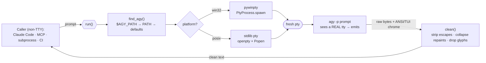

# agy-headless-bridge

Call the **Google Antigravity CLI (`agy`)** headlessly — from a subprocess, a
pipe, an MCP server, a CI job, or another coding agent (e.g. Claude Code) — and
actually get its output back.

Ships two things:

1. **A pty bridge** (`agy_headless_bridge.bridge`) — runs `agy -p "<prompt>"`
   through a fresh pseudo-terminal so its stdout is not silently dropped.
2. **An MCP server** (`agy_headless_bridge.mcp_server`) — exposes `agy` as
   `agy_ask` / `agy_research` tools to any MCP client.

> 📖 **[Architecture & docs page → rhishi99.github.io/agy-headless-bridge](https://rhishi99.github.io/agy-headless-bridge/)**
> (source: [`docs/index.html`](docs/index.html)). Codename: **PtyGravity**.

---

## The problem (upstream bug [#76])

`agy -p "<prompt>"` gates its stdout on `isatty()`. When stdout is **not** a
real terminal — i.e. any time you call it from automation — it prints nothing
and exits `0`:

```console
$ agy -p "say hi" | cat
$            # <- empty. exit code 0. no error.
```

The usual workaround, `winpty agy -p "..."`, needs a terminal that *already
exists*, so it still fails from a subprocess / MCP server / CI runner.

## The fix

Allocate a **fresh** pseudo-terminal and attach `agy` to it. `agy` sees a real
tty, emits normally; the bridge reads the pty, strips the ANSI/TUI noise, and
returns clean text.

| Platform | Mechanism |
|----------|-----------|
| Windows  | ConPTY via [`pywinpty`] (`PtyProcess`) — creates a new pty with no parent-tty requirement |
| Linux / macOS | stdlib [`pty`] (`os.openpty` + `subprocess.Popen`) |



> **Why not just the popular `agy` Claude Code plugins?** They wrap `agy` for
> *triggering* (slash commands, model selection) but still call `agy -p`
> directly — so on Windows / headless they hit the exact same empty-output bug.
> This package fixes the I/O layer they're missing. Use both together.

---

## Install

```bash
pip install agy-headless-bridge
# Windows pulls in pywinpty automatically; POSIX uses the stdlib pty module.
```

From source:

```bash
git clone https://github.com/rhishi99/agy-headless-bridge
cd agy-headless-bridge
pip install -e .
```

You still need the Antigravity CLI itself installed and authenticated
(<https://antigravity.google/cli>). The bridge finds it via, in order:

1. `$AGY_PATH` (explicit path to the binary)
2. `agy` on your `PATH`
3. OS default install locations

---

## Usage

### As a library

```python
from agy_headless_bridge import run

answer = run("Explain the difference between a process and a thread in one line.")
print(answer)
```

```python
from agy_headless_bridge import run, AgyNotFoundError

try:
    print(run("reply with exactly: OK", timeout=60))
except AgyNotFoundError:
    print("install agy first")
```

### As a CLI

```bash
python -m agy_headless_bridge "reply with exactly: OK"
# or, via the console script:
agy-bridge "reply with exactly: OK"
```

### As an MCP server (Claude Code, etc.)

```bash
claude mcp add --transport stdio antigravity -- \
    python -m agy_headless_bridge.mcp_server
```

Or add to your MCP config manually:

```json
{
  "mcpServers": {
    "antigravity": {
      "command": "python",
      "args": ["-m", "agy_headless_bridge.mcp_server"]
    }
  }
}
```

Then your agent can call the `agy_ask` and `agy_research` tools to delegate
work to Antigravity / Gemini.

---

## Configuration

| Env var | Default | Meaning |
|---------|---------|---------|
| `AGY_PATH` | auto-detect | Absolute path to the `agy` binary |
| `AGY_BRIDGE_TIMEOUT` | `180` | Seconds before a call is killed |

---

## Development

```bash
pip install -e ".[dev]"
pytest
```

Unit tests (output cleaning, arg validation, binary discovery) always run. The
live round-trip test auto-skips when `agy` is not installed, so CI passes
without Antigravity present.

---

## Scope / non-goals

- **Model selection** (swapping Gemini Pro / Flash / Claude inside agy) is *not*
  handled here — it's an `agy` settings concern. The pre-existing
  `antigravity-cc` Claude Code plugin already does that by patching
  `settings.json`; pair it with this bridge.
- This bridge does not install or authenticate `agy`.

## License

MIT — see [LICENSE](LICENSE).

[#76]: https://antigravity.google/cli
[`pywinpty`]: https://github.com/andfoy/pywinpty
[`pty`]: https://docs.python.org/3/library/pty.html
